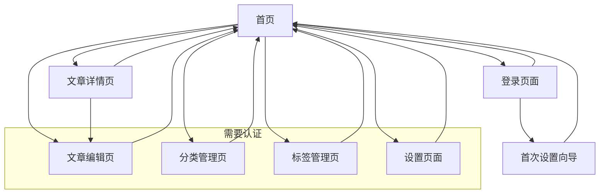

# 芥子博客产品需求文档

## 1. 产品概述
芥子博客是一个功能完整的现代化博客系统，支持Web版和桌面版双平台部署。采用React+TypeScript前端和Node.js+Express后端架构，提供完整的文章管理、用户认证、数据备份等企业级功能。
- 解决个人和团队的内容管理需求，提供专业的写作、发布和管理平台，支持Markdown编辑和多媒体内容。
- 项目已达到生产就绪状态，支持一键部署和跨平台运行，可满足从个人博客到企业内容管理的多种场景需求。

## 2. 核心功能

### 2.1 用户角色
系统支持多用户和权限管理，提供完整的用户认证和授权机制：

| 角色 | 注册方式 | 核心权限 |
|------|----------|----------|
| 管理员 | 首次注册自动成为管理员 | 完整的系统管理权限：文章管理、分类管理、用户管理、系统设置、数据备份 |
| 普通用户 | 邮箱注册（需管理员开启） | 浏览文章、个人资料管理（具体权限可由管理员配置） |

### 2.2 功能模块
芥子博客已实现以下完整功能模块：
1. **首页**：响应式文章列表、智能分类导航、全文搜索、分页浏览
2. **文章详情页**：Markdown渲染、代码高亮、浏览统计、SEO优化
3. **文章编辑页**：实时预览Markdown编辑器、图片拖拽上传、草稿保存、标签管理
4. **分类管理页**：分类CRUD操作、颜色标识、文章统计、批量管理
5. **标签管理页**：标签创建、关联管理、使用统计
6. **用户认证页**：登录、注册、密码加密、JWT认证
7. **设置页面**：系统配置、数据备份导出、数据恢复导入、用户管理
8. **首次设置向导**：引导用户完成初始配置

### 2.3 页面详情

| 页面名称 | 模块名称 | 功能描述 |
|----------|----------|----------|
| 首页 | 文章列表 | 响应式卡片布局展示文章，包含标题、摘要、发布日期、分类标签、浏览量统计 |
| 首页 | 分类导航 | 动态分类标签栏，支持颜色标识，点击筛选对应分类文章 |
| 首页 | 搜索功能 | 全文搜索支持标题、内容、摘要检索，实时搜索结果展示 |
| 首页 | 分页浏览 | 智能分页加载，支持页码跳转和每页数量配置 |
| 文章详情页 | 内容渲染 | 完整Markdown渲染，支持代码高亮、表格、图片等富文本内容 |
| 文章详情页 | 文章信息 | 显示发布时间、更新时间、分类、标签、浏览量、字数统计 |
| 文章详情页 | SEO优化 | 自动生成meta标签，支持自定义标题和描述 |
| 文章编辑页 | Markdown编辑器 | 实时预览编辑器，支持语法高亮、快捷键操作、全屏编辑 |
| 文章编辑页 | 图片管理 | 拖拽上传图片，自动压缩优化，生成Markdown语法插入 |
| 文章编辑页 | 文章管理 | 草稿保存、发布状态切换、分类选择、标签管理、SEO设置 |
| 分类管理页 | 分类CRUD | 创建、编辑、删除分类，支持颜色自定义和描述设置 |
| 分类管理页 | 统计信息 | 显示每个分类的文章数量、最新文章、创建时间 |
| 标签管理页 | 标签操作 | 标签的创建、编辑、删除，查看标签使用频率和关联文章 |
| 用户认证页 | 登录注册 | 用户名密码登录、新用户注册、密码加密存储、JWT认证 |
| 用户认证页 | 权限控制 | 基于角色的访问控制，保护管理功能页面 |
| 设置页面 | 系统配置 | 博客基本信息设置、SEO配置、用户权限管理 |
| 设置页面 | 数据备份 | 完整数据库备份导出、JSON格式数据恢复导入 |
| 设置页面 | 主题设置 | 深色/浅色主题切换，界面个性化配置 |
| 首次设置 | 初始化向导 | 引导用户创建管理员账户、配置基本信息、完成系统初始化 |

## 3. 核心流程

**访客用户流程：**
1. 访问首页浏览公开文章列表
2. 通过分类导航、搜索功能或分页浏览找到感兴趣的内容
3. 点击文章标题进入详情页阅读完整内容
4. 可注册账户获得更多功能权限

**管理员用户流程：**
1. 首次访问系统时通过设置向导创建管理员账户
2. 登录后获得完整的系统管理权限
3. 在文章编辑页面创建和发布新文章，支持Markdown编辑和图片上传
4. 在分类管理页面创建和组织文章分类体系
5. 在标签管理页面管理文章标签和关联关系
6. 在设置页面进行系统配置、数据备份和用户管理
7. 可随时切换主题和个性化界面设置

## 4. 用户界面设计

### 4.1 设计风格
- **主色调**：#007AFF（iOS蓝色）、#F2F2F7（浅灰背景）
- **辅助色**：#34C759（成功绿色）、#FF3B30（警告红色）、#8E8E93（次要文字灰色）
- **按钮风格**：圆角矩形按钮，8px圆角，轻微阴影效果
- **字体**：系统默认字体，标题18-24px，正文16px，次要信息14px
- **布局风格**：卡片式设计，充足的留白，顶部导航栏
- **图标风格**：使用SF Symbols风格的线性图标

### 4.2 页面设计概览

| 页面名称 | 模块名称 | UI元素 |
|----------|----------|--------|
| 首页 | 文章列表 | 响应式网格布局，白色卡片背景带阴影，标题使用粗体，日期和分类使用小号灰色文字，浏览量统计 |
| 首页 | 分类导航 | 水平滚动标签栏，支持自定义颜色，选中状态高亮显示，平滑过渡动画 |
| 首页 | 搜索栏 | 顶部固定搜索框，支持实时搜索提示，清除按钮和搜索历史 |
| 文章详情页 | 内容展示 | 最大宽度800px居中，Markdown完整渲染，代码语法高亮，图片懒加载 |
| 文章详情页 | 文章元信息 | 顶部面包屑导航，底部标签云，侧边栏目录导航（长文章） |
| 文章编辑页 | 编辑器 | 分屏布局，左侧Markdown编辑，右侧实时预览，工具栏快捷操作 |
| 文章编辑页 | 图片上传 | 拖拽上传区域，进度条显示，缩略图预览，批量管理 |
| 分类管理页 | 分类列表 | 卡片网格布局，颜色标识，统计信息，快速操作按钮 |
| 标签管理页 | 标签云 | 动态标签云展示，大小表示使用频率，颜色分类，搜索过滤 |
| 用户认证页 | 登录表单 | 居中卡片布局，输入验证提示，记住登录状态，安全提示 |
| 设置页面 | 配置面板 | 分组的设置项，卡片容器，开关按钮，实时保存提示 |
| 设置页面 | 备份管理 | 文件上传区域，备份历史列表，一键导出按钮，进度指示器 |

### 4.3 响应式设计
采用移动优先的响应式设计，支持从手机到4K显示器的全设备适配。移动端优化触控交互，桌面端提供高效的键盘快捷键操作。编辑页面在移动端自动切换为上下布局，确保最佳的编辑体验。

## 5. 技术架构现状

### 5.1 前端技术栈
- **框架**: React 18 + TypeScript，提供类型安全和现代化开发体验
- **构建工具**: Vite，快速的开发服务器和构建工具
- **样式方案**: Tailwind CSS，原子化CSS框架，支持深色模式
- **路由管理**: React Router DOM 7，支持嵌套路由和懒加载
- **状态管理**: Zustand，轻量级状态管理库
- **UI组件**: Lucide React图标库，自定义组件系统
- **Markdown**: react-markdown + remark-gfm，完整的Markdown渲染支持
- **编辑器**: @uiw/react-md-editor，专业的Markdown编辑器

### 5.2 后端技术栈
- **运行时**: Node.js + Express 4，成熟稳定的服务器框架
- **语言**: TypeScript，提供完整的类型检查和开发体验
- **数据库**: SQLite3 + better-sqlite3，轻量级关系数据库，支持事务
- **认证**: JWT + bcryptjs，安全的用户认证和密码加密
- **文件上传**: Multer，支持多媒体文件上传和管理
- **跨域**: CORS中间件，支持前后端分离部署

### 5.3 桌面应用支持
- **框架**: Electron 32，支持跨平台桌面应用打包
- **构建**: electron-builder，自动化打包和分发
- **开发模式**: 热重载开发环境，支持并发前后端调试

## 6. 部署方案

### 6.1 Web版部署
- **构建命令**: `pnpm run build` - 自动构建前端和后端代码
- **部署包**: 包含完整的静态资源和API服务
- **数据库**: SQLite文件，支持数据迁移和备份
- **环境要求**: Node.js 18+，支持Docker容器化部署

### 6.2 桌面版部署
- **打包命令**: `pnpm run electron:build` - 生成跨平台安装包
- **支持平台**: Windows、macOS、Linux
- **数据存储**: 本地SQLite数据库，支持数据导入导出
- **自动更新**: 支持应用自动更新机制

### 6.3 一键部署
- **部署脚本**: `deploy.sh` - 自动化部署脚本
- **部署包**: `jiezi-blog-deploy.tar.gz` - 包含所有依赖的完整部署包
- **配置文件**: 支持环境变量配置，适应不同部署环境
- **数据迁移**: 支持数据库文件迁移和路径配置

## 7. 项目完成度与生产就绪状态

### 7.1 核心功能完成度
- ✅ **用户认证系统**: 完整的注册、登录、权限控制
- ✅ **文章管理系统**: 创建、编辑、发布、删除、搜索
- ✅ **分类标签系统**: 分类和标签的完整CRUD操作
- ✅ **图片上传系统**: 拖拽上传、自动优化、批量管理
- ✅ **数据备份系统**: 完整的数据导出导入功能
- ✅ **系统设置**: 个性化配置、主题切换、SEO设置
- ✅ **响应式设计**: 全设备适配，优秀的用户体验

### 7.2 技术质量保证
- ✅ **类型安全**: 完整的TypeScript类型定义
- ✅ **错误处理**: 完善的错误捕获和用户提示
- ✅ **性能优化**: 代码分割、懒加载、图片优化
- ✅ **安全防护**: JWT认证、密码加密、XSS防护
- ✅ **数据完整性**: 事务支持、数据验证、备份恢复

### 7.3 部署与运维
- ✅ **构建系统**: 稳定的构建流程，支持生产环境打包
- ✅ **部署方案**: 多种部署方式，适应不同场景需求
- ✅ **监控日志**: 完整的错误日志和运行状态监控
- ✅ **数据管理**: 便捷的数据备份恢复和迁移工具

**项目当前状态**: 🎉 **生产就绪** - 所有核心功能已完成开发和测试，可直接用于生产环境部署和使用。