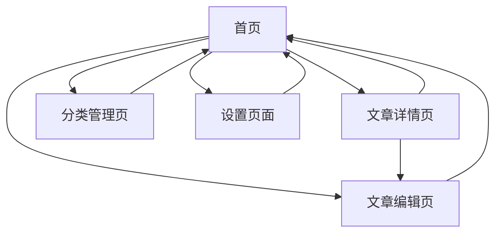

# 芥子博客产品需求文档

## 1. 产品概述
芥子博客是一个简洁优雅的个人博客系统，专为记录日常心得和读书笔记而设计。采用iOS风格的简约设计理念，提供直观的文章管理和编辑体验。
- 解决个人知识管理和思考记录的需求，为用户提供一个专注写作和内容整理的平台。
- 目标是打造一个轻量级、易用且功能完整的个人博客解决方案。

## 2. 核心功能

### 2.1 用户角色
本系统为单用户博客系统，无需复杂的用户权限管理。

### 2.2 功能模块
我们的博客需求包含以下主要页面：
1. **首页**：文章列表展示、分类导航、搜索功能
2. **文章详情页**：完整文章内容展示、相关文章推荐
3. **文章编辑页**：Markdown编辑器、图片上传、文章发布
4. **分类管理页**：分类创建、编辑、删除管理
5. **设置页面**：数据备份、恢复、系统配置

### 2.3 页面详情

| 页面名称 | 模块名称 | 功能描述 |
|----------|----------|----------|
| 首页 | 文章列表 | 展示文章标题、发布日期、文章摘要（前150字）、分类标签 |
| 首页 | 分类导航 | 显示所有分类，支持按分类筛选文章 |
| 首页 | 搜索功能 | 支持按标题和内容搜索文章 |
| 文章详情页 | 内容展示 | 完整显示文章内容，支持Markdown渲染 |
| 文章详情页 | 文章信息 | 显示发布时间、分类、字数统计 |
| 文章编辑页 | Markdown编辑器 | 支持实时预览的Markdown编辑功能 |
| 文章编辑页 | 图片上传 | 支持拖拽上传图片，自动插入Markdown语法 |
| 文章编辑页 | 文章管理 | 保存草稿、发布文章、设置分类和标签 |
| 分类管理页 | 分类操作 | 创建、编辑、删除分类，查看每个分类的文章数量 |
| 设置页面 | 数据管理 | SQLite数据库备份和恢复功能 |
| 设置页面 | 系统配置 | 博客标题、描述等基本信息设置 |

## 3. 核心流程

**主要用户操作流程：**
1. 用户访问首页浏览文章列表
2. 可通过分类筛选或搜索找到感兴趣的文章
3. 点击文章标题进入详情页阅读完整内容
4. 通过编辑页面创建新文章或编辑现有文章
5. 在分类管理页面组织文章分类
6. 在设置页面进行数据备份和系统配置

## 4. 用户界面设计

### 4.1 设计风格
- **主色调**：#007AFF（iOS蓝色）、#F2F2F7（浅灰背景）
- **辅助色**：#34C759（成功绿色）、#FF3B30（警告红色）、#8E8E93（次要文字灰色）
- **按钮风格**：圆角矩形按钮，8px圆角，轻微阴影效果
- **字体**：系统默认字体，标题18-24px，正文16px，次要信息14px
- **布局风格**：卡片式设计，充足的留白，顶部导航栏
- **图标风格**：使用SF Symbols风格的线性图标

### 4.2 页面设计概览

| 页面名称 | 模块名称 | UI元素 |
|----------|----------|--------|
| 首页 | 文章列表 | 白色卡片背景，标题使用粗体，日期和分类使用小号灰色文字，文章摘要使用常规字重 |
| 首页 | 分类导航 | 水平滚动的标签栏，选中状态使用蓝色背景，未选中使用灰色边框 |
| 文章详情页 | 内容展示 | 最大宽度800px居中显示，行间距1.6，代码块使用等宽字体和浅灰背景 |
| 文章编辑页 | 编辑器 | 左右分栏布局，左侧编辑区，右侧实时预览，工具栏使用图标按钮 |
| 分类管理页 | 分类列表 | 表格形式展示，每行包含分类名称、文章数量和操作按钮 |
| 设置页面 | 功能区块 | 分组的设置项，每组使用卡片容器，按钮使用iOS风格的开关和按钮 |

### 4.3 响应式设计
采用移动优先的响应式设计，在移动设备上提供良好的触控体验，桌面端优化阅读和编辑体验。编辑页面在移动端采用上下布局替代左右分栏。