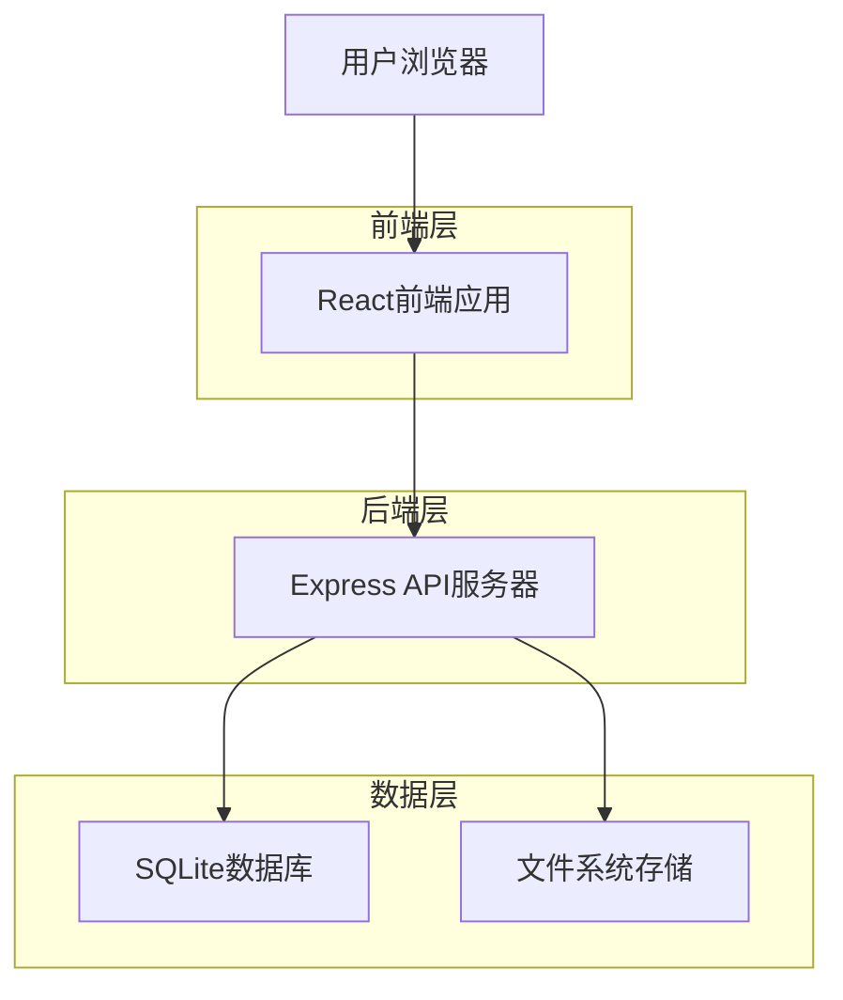
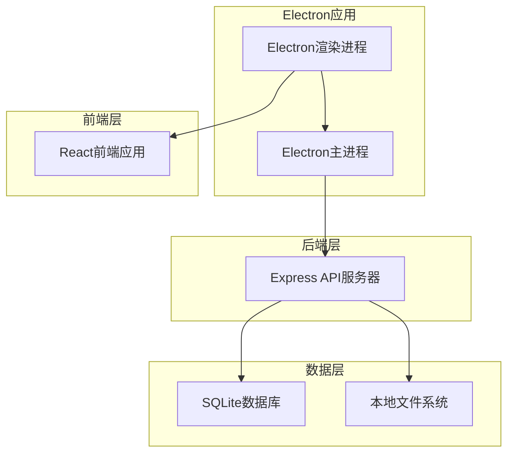
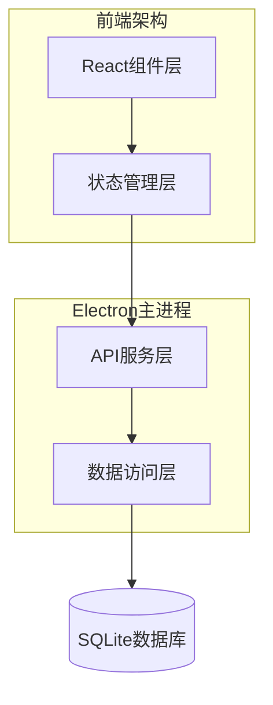
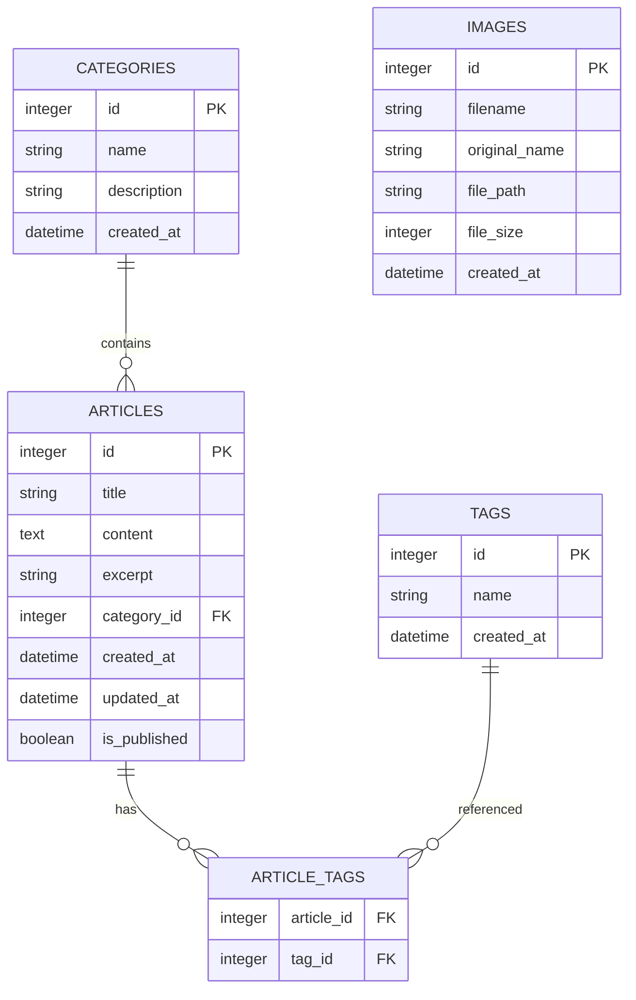

# 芥子博客技术架构文档

## 1. 架构设计

### 1.1 Web版架构



### 1.2 桌面版架构



## 2. 技术描述

### 2.1 前端技术栈

* **核心框架**: React\@18 + TypeScript - 现代化前端开发框架

* **构建工具**: Vite\@6 - 快速的开发服务器和构建工具

* **样式框架**: Tailwind CSS\@3 - 原子化CSS框架，支持深色模式

* **路由管理**: React Router DOM\@7 - 客户端路由管理

* **状态管理**: Zustand\@5 - 轻量级状态管理库

* **UI组件**: Lucide React - 现代图标库

* **通知系统**: Sonner - 优雅的通知组件

### 2.2 后端技术栈

* **运行时**: Node.js + Express\@4 - 服务器框架

* **语言**: TypeScript - 类型安全的JavaScript

* **数据库**: SQLite3 + better-sqlite3 - 轻量级关系数据库

* **认证**: JWT + bcryptjs - 用户认证和密码加密

* **文件上传**: Multer - 多媒体文件处理

* **跨域**: CORS - 跨域资源共享支持

### 2.3 内容处理

* **Markdown渲染**: react-markdown + remark-gfm - 完整的Markdown支持

* **代码编辑器**: @uiw/react-md-editor - 专业的Markdown编辑器

* **图片处理**: 本地文件系统存储 + 自动优化

### 2.4 桌面应用

* **桌面框架**: Electron\@32 - 跨平台桌面应用

* **构建工具**: electron-builder - 应用打包和分发

* **开发工具**: concurrently + wait-on - 并发开发环境

## 3. 路由定义

### 3.1 前端路由

| 路由           | 用途             | 权限要求  |
| ------------ | -------------- | ----- |
| /            | 首页，显示文章列表和分类导航 | 公开访问  |
| /article/:id | 文章详情页，显示完整文章内容 | 公开访问  |
| /login       | 用户登录页面         | 公开访问  |
| /register    | 用户注册页面         | 公开访问  |
| /edit        | 新建文章编辑页        | 需要认证  |
| /edit/:id    | 编辑现有文章页面       | 需要认证  |
| /categories  | 分类管理页面         | 管理员权限 |
| /settings    | 设置页面，包含备份恢复功能  | 管理员权限 |

### 3.2 API路由

| 路由分组               | 主要功能     | 权限控制          |
| ------------------ | -------- | ------------- |
| /api/auth/\*       | 用户认证相关接口 | 部分需要认证        |
| /api/articles/\*   | 文章管理接口   | 读取公开，写入需认证    |
| /api/categories/\* | 分类管理接口   | 读取公开，写入需管理员权限 |
| /api/tags/\*       | 标签管理接口   | 读取公开，写入需认证    |
| /api/images/\*     | 图片上传接口   | 需要认证          |
| /api/settings/\*   | 系统设置接口   | 需要管理员权限       |

## 4. API定义

### 4.1 核心API

文章相关接口

```
GET /api/articles
```

请求参数：

| 参数名称     | 参数类型   | 是否必需  | 描述        |
| -------- | ------ | ----- | --------- |
| category | string | false | 按分类筛选     |
| search   | string | false | 搜索关键词     |
| page     | number | false | 页码，默认1    |
| limit    | number | false | 每页数量，默认10 |

响应：

| 参数名称     | 参数类型       | 描述    |
| -------- | ---------- | ----- |
| articles | Article\[] | 文章列表  |
| total    | number     | 总数量   |
| hasMore  | boolean    | 是否有更多 |

```
POST /api/articles
```

请求：

| 参数名称     | 参数类型      | 是否必需  | 描述         |
| -------- | --------- | ----- | ---------- |
| title    | string    | true  | 文章标题       |
| content  | string    | true  | Markdown内容 |
| category | string    | true  | 分类名称       |
| tags     | string\[] | false | 标签数组       |

响应：

| 参数名称      | 参数类型    | 描述     |
| --------- | ------- | ------ |
| success   | boolean | 操作结果   |
| articleId | number  | 新建文章ID |

分类管理接口

```
GET /api/categories
POST /api/categories
PUT /api/categories/:id
DELETE /api/categories/:id
```

图片上传接口

```
POST /api/upload/image
```

数据备份接口

```
POST /api/backup/export
POST /api/backup/import
```

## 5. 服务器架构图



## 6. 数据模型

### 6.1 数据模型定义



### 6.2 数据定义语言

文章表 (articles)

```sql
-- 创建文章表
CREATE TABLE articles (
    id INTEGER PRIMARY KEY AUTOINCREMENT,
    title VARCHAR(255) NOT NULL,
    content TEXT NOT NULL,
    excerpt TEXT,
    category_id INTEGER,
    created_at DATETIME DEFAULT CURRENT_TIMESTAMP,
    updated_at DATETIME DEFAULT CURRENT_TIMESTAMP,
    is_published BOOLEAN DEFAULT 1,
    FOREIGN KEY (category_id) REFERENCES categories(id)
);

-- 创建分类表
CREATE TABLE categories (
    id INTEGER PRIMARY KEY AUTOINCREMENT,
    name VARCHAR(100) NOT NULL UNIQUE,
    description TEXT,
    created_at DATETIME DEFAULT CURRENT_TIMESTAMP
);

-- 创建标签表
CREATE TABLE tags (
    id INTEGER PRIMARY KEY AUTOINCREMENT,
    name VARCHAR(50) NOT NULL UNIQUE,
    created_at DATETIME DEFAULT CURRENT_TIMESTAMP
);

-- 创建文章标签关联表
CREATE TABLE article_tags (
    article_id INTEGER,
    tag_id INTEGER,
    PRIMARY KEY (article_id, tag_id),
    FOREIGN KEY (article_id) REFERENCES articles(id) ON DELETE CASCADE,
    FOREIGN KEY (tag_id) REFERENCES tags(id) ON DELETE CASCADE
);

-- 创建图片表
CREATE TABLE images (
    id INTEGER PRIMARY KEY AUTOINCREMENT,
    filename VARCHAR(255) NOT NULL,
    original_name VARCHAR(255) NOT NULL,
    file_path VARCHAR(500) NOT NULL,
    file_size INTEGER,
    created_at DATETIME DEFAULT CURRENT_TIMESTAMP
);

-- 创建索引
CREATE INDEX idx_articles_category ON articles(category_id);
CREATE INDEX idx_articles_created_at ON articles(created_at DESC);
CREATE INDEX idx_articles_title ON articles(title);
CREATE INDEX idx_article_tags_article ON article_tags(article_id);
CREATE INDEX idx_article_tags_tag ON article_tags(tag_id);

-- 插入初始数据
INSERT INTO categories (name, description) VALUES 
('日常心得', '记录日常生活的感悟和思考'),
('读书笔记', '阅读书籍后的总结和感想'),
('技术分享', '技术学习和实践的记录');

INSERT INTO tags (name) VALUES 
('生活'), ('思考'), ('成长'), ('技术'), ('读书');
```

